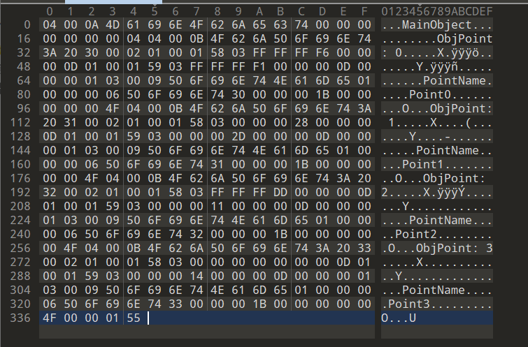
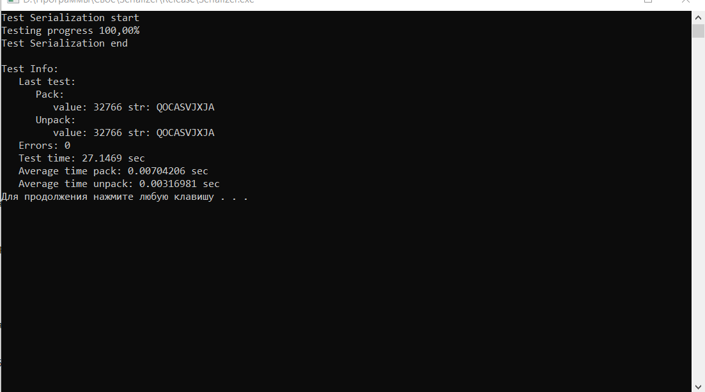
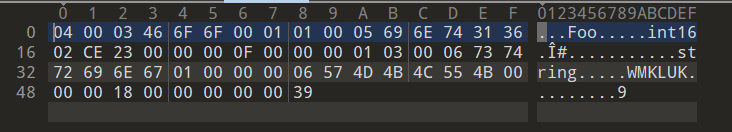

<h1 align="center">Сериализация</h1>

Сериализация — это процесс преобразования объекта в поток байтов для сохранения или передачи в память, базу данных или файл. Эта операция предназначена для того, чтобы сохранить состояния объекта для последующего воссоздания при необходимости. Обратный процесс называется десериализацией.
<h1 align="center">О программе</h1>
Данная программа реализует сериализацию и десериализацию данных такие как: Примитивы(int, float, char и др), Массивы(vector и string), Объекты(Контейнер хранящий Примитивы, Массивы и Объекты) и является простым консольным приложением для тестирования, и демонстрации возможности сохранения данных и их востановление.

<h1 align="center">Скриншоты</h1>
<h2>
Пример сохранения кастомных данных в файле:

</h2>
<h2>
Скриншот cmd:

</h2>
<h2>
Скриншот данных в файле во время тестирования:

</h2>
