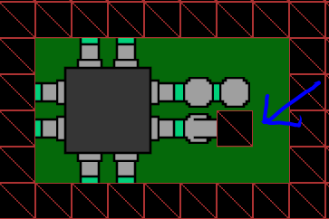

<h1>Wave Function Collapse</h1>
Wave Function Collapse - Коллапс волновой функции прямо из квантовой механики — это алгоритм процедурной генерации изображений.

<h1>О программе</h1>
Я пробую мозаичную модель и исследую различные решения алгоритма в C++ с помощью sfml.  
При запуске программы необходимо выбрать папку с тайлами(все папки с тайлами должы лежать в каталоге "tiles", максимальное колличесво папок 7).  
После загрузки тайлов вы можете выставлять тайлы на сетку  
Вы можете сгенерировать карту как с заранее выставлеными тайлами, так и без них  
При выставление тайлов нужно убедится, что не возникает противоречий(алгоритм не сможет заполнить сетку если в ней есть противоречия)  
Пример неверного выставления тайлов(в данном примере не существует тайла который подошёл бы к этой ячейке):  

<h1>Пример работы программы</h1>
 

<h1>Управление</h1>
M - показать/скрыть Меню
Space - запуск/пауза Генерации
LAlt - очистить сетку(с сохранением выставленых тайлов)
LControl - очистить сетку(без сохранением выставленых тайлов)
LMB - навигация по меню, выставление тайлов
RMB - убрать выделение
Mouse wheel - повернуть тайл(вверх - по часовой//вниз - против часовой)
